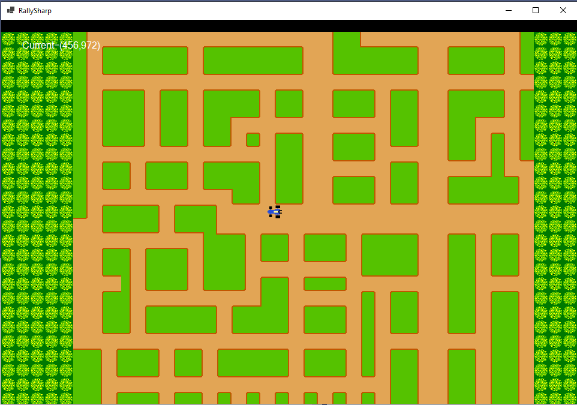

# RallySharp
RallySharp is an implementation of the famous game Rally X di Namco in .NET. 
It is an exercise to use modern .NET 5 technology to implement it. Currently it uses Windows Form as UI and System.Drawing as rendering technology.
The objective behind this is the implementation of a tile-based framework to implements '80 style games.
## 2021.01.10
- The game is in its initial stages, with scrolling and car movements and collision with tiles; but a lot of things are missing.
- Graphics is ripped from original arcade version

- It is in 1:1 scale: zoom will be implemented soon